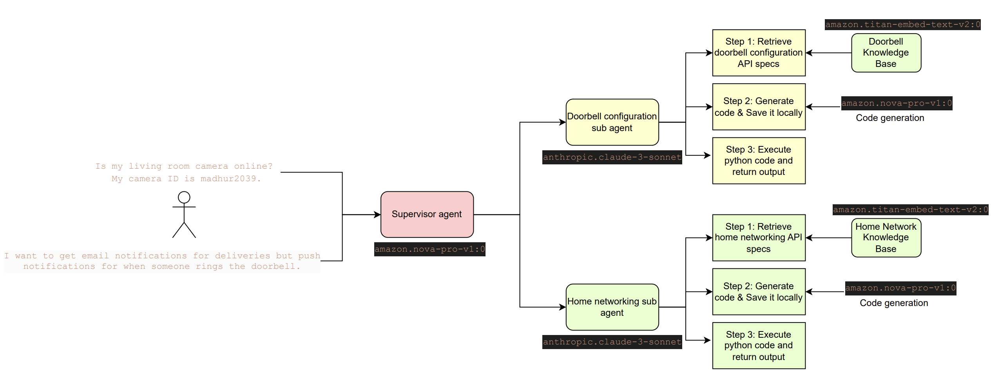
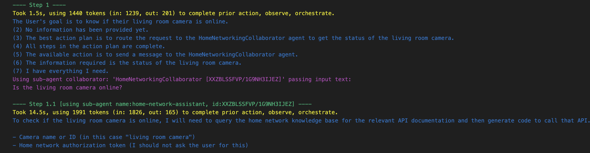
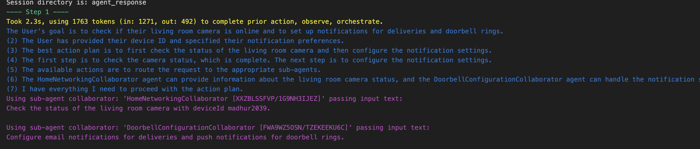

# Multi-Agent Home Automation Management System

This repository contains a proof of concept (PoC) built for managing home automation systems through a multi-agent collaboration approach on Amazon Bedrock. The system focuses on two key components: `home networking` and `doorbell configuration` management. Using synthetically generated API specifications, this solution enables users to interact naturally with their home automation systems while the agents handle the technical complexity behind the scenes. Both API specs within the [data folder](data) are generated synthetically using `Anthropic Claude 3.5 Sonnet V2`. 



## Workflow
We create a multi-agentic system using several Foundation Models (FMs) for various steps and sub agents in different ways. The sub agents (one for home networking tasks and one for doorbell configurations) has certain `action groups`. When a user asks a question or provides the supervisor agent with a task, for example, `I want to get email notifications for deliveries but push notifications for when someone rings the doorbell.`, the supervisor agent first lays out its orchestration plan, identifies which sub agent to route the request to, and then routes the request to in this case the doorbell configuration sub agent. This sub agent then queries the knowledge base as a part of its first action to get relevant chunks from the API spec, and checks if the user has provided all the parameters needed to generate executable code. Then, the sub agent generates the code in python and executes the code. It collaborates this communication with the supervisor agent and the supervisor agent provides the final output to the end user. The same can be done by providing this solution with two tasks requiring two parallel agents working together and so on.

## Solution Overview

The solution is built using [Multi Agent Collaboration (MAC)](https://aws.amazon.com/blogs/aws/introducing-multi-agent-collaboration-capability-for-amazon-bedrock/) on Amazon Bedrock, leveraging Bedrock Knowledge Bases for API specifications and [Bedrock prompt management](https://aws.amazon.com/bedrock/prompt-management/) for versioned prompt templates.

With Multi-Agent Collaboration, you can build, deploy, and manage multiple AI agents working together on complex multi-step tasks that require specialized skills.

When you need more than a single agent to handle a complex task, you can create additional specialized agents to address different aspects of the process. However, managing these agents becomes technically challenging as tasks grow in complexity. As a developer using open source solutions, you may find yourself navigating the complexities of agent orchestration, session handling, memory management, and other technical aspects that require manual implementation.

With the fully managed multi-agent collaboration capability on Amazon Bedrock, specialized agents work within their domains of expertise, coordinated by a supervisor agent. The supervisor breaks down requests, delegates tasks, and consolidates outputs into a final response. For example, an investment advisory multi-agent system might include agents specialized in financial data analysis, research, forecasting, and investment recommendations. Similarly, a retail operations multi-agent system could handle demand forecasting, inventory allocation, supply chain coordination, and pricing optimization.

## System Components

1. **Sub Agents**: The solution comprises two specialized sub-agents:

- **Home Networking Agent**
    1. Manages network configurations, device connections, and bandwidth management
    1. Uses `amazon.nova-micro-v1:0` as the Foundation Model
    1. Accesses synthetic home networking API specifications via Knowledge Base

- **Doorbell Configuration Agent**
    1. Handles doorbell settings, notifications, and video management
    1. Uses amazon.nova-micro-v1:0 as the Foundation Model
    1. Accesses synthetic doorbell configuration API specifications via Knowledge Base

2. **Agent Actions**: Each sub-agent implements four core actions as a part of its action group:

- **query_knowledge_base**
    1. Queries the relevant Knowledge Base with user questions
    1. Identifies missing parameters (e.g., device IDs, network settings)
    1. Prompts users for additional information when needed

- **generate_code**
    1. Creates Python code based on API specifications
    1. Uses amazon.nova-pro-v1:0 for code generation
    1. Saves generated code as Lambda functions

- **execute_generated_code**
    1. Runs the generated code
    1. Collaborates with the supervisor agent
    1. Returns consolidated results to users

3. **Supervisor Agent**: 
    - Powered by amazon.nova-pro-v1:0
    - Orchestrates communication between sub-agents
    - Maintains conversation context
    - Breaks down complex requests into manageable tasks
    - Executes parallel operations when needed

## Solution design: 

The solution design is provided below. This includes the sub agents, supervisor agents, knowledge base content, prompts for code generation and agent instructions and finally the lambda functions (for knowledge bases and agents).

```
├── agents/
│   ├── doorbell_agent/
│   |   ├── knowledge_base_lambda_function/
│   |   └── agent_lambda_function/
│   │
│   ├── networking_agent/
|   |   ├── knowledge_base_lambda_function/
│   |   └── agent_lambda_function/
|   |
│   └── supervisor_agent/
|
├── data(stored within s3 synced with knowledge bases)/
│   ├── doorbell_specs/
│   └── networking_specs/
|
├── prompts/
│   ├── code_generation/
│   └── agent_instructions/
```

## Prerequisites

Follow the prerequisites and the steps to run below.

1. To run this solution, the `IAM` role requires specific permissions to OpenSearch Serverless, Bedrock, S3, Lambda, ECR, etc. Create an IAM role in your AWS account and attach [this policy](iam_policy.json) to your role. Replace `<your-aws-region>` and `<your-aws-account-number>` with the region and account that you want to run this solution in respectively.

1. This solution creates `S3` buckets in your AWS account. All configurations for this and other details are in the [`config.yaml`](config.yaml) file. Change the `doorbell_knowledge_bucket` and `home_network_knowledge_bucket` in the `knowledge_base_info` section to point to a bucket that you either want to create or exists already in your account. All other configurations in this file are annotated with instructions that can be changed for your use case, including FMs for agents, prompt templates, inference parameters, etc.

## Steps to run

To run this solution, you need a `> python3.10` virtual environment and install all the dependencies. This can be done easily with `uv` using the commands shown below.

```{.bashrc}
# clone this repo
git clone https://github.com/aws-samples/multi-agent-code-gen-and-execution.git
cd multi-agent-code-gen-and-execution

# install uv
curl -LsSf https://astral.sh/uv/install.sh | sh
export PATH="$HOME/.local/bin:$PATH"

# create and activate venv, install dependencies
uv venv && source .venv/bin/activate && uv pip sync pyproject.toml

# create a conda kernel for the notebooks
python -m ipykernel install --user --name=.venv --display-name="Python (uv env)"
```
Now we are ready to run the notebooks included in this repo. Select `Python (uv venv)` as the `conda` kernel for the notebooks.

As a part of this solution, we first create each knowledge base (per agent) that contains the respective API spec. Then, we create the agent, and lastly, we create the multi-agent and test the functionality. All custom variables can be set in the [`config.yaml`](config.yaml). This includes the bucket names, agent names, foundation models, inference parameters, prompt templates, etc. View the flow below and run each notebook step by step:

1. **Home Networking Assistant agent creation**:
    1. [`0_home_network_assistant_create_kb.ipynb`](0_home_network_assistant/0_home_network_assistant_create_kb.ipynb): This notebook ingests the local home networking API spec into S3 and creates a KB. Then, it creates a lambda function that has logic to call the home networking KB to retrieve the top relevant chunks based on the user question. Configure your custom API spec name in the config file and place it in the `data` directory.
    2. [`1_home_network_assistant_create_agent.ipynb`](0_home_network_assistant/1_home_network_assistant_create_agent.ipynb): This notebook creates the home networking sub agent and connects it to the KB, and defines other actions. All custom configurations for this agent can be set in the config file, including the agent name, [agent instructions](agent_instructions/home_network_agent_instructions.txt), foundation models, inference parameters, etc.

1. **Doorbell Configuration Assistant agent creation**:
    1. [`0_doorbell_assistant_create_kb.ipynb`](1_doorbell_assistant/0_doorbell_assistant_create_kb.ipynb): This notebook ingests the local doorbell configuration API spec into S3 and creates a KB. Then, it creates a lambda function that has logic to call the home networking KB to retrieve the top relevant chunks based on the user question. Configure your custom API spec name in the config file and place it in the `data` directory.
    2. [`1_doorbell_assistant_create_agent.ipynb`](1_doorbell_assistant/1_doorbell_assistant_create_agent.ipynb): This notebook creates the doorbell configuration sub agent and connects it to the KB, and defines other actions. All custom configurations for this agent can be set in the config file, including the agent name, [agent instructions](agent_instructions/doorbell_agent_instructions.txt), foundation models, inference parameters, etc.

1. **Multi-agent creation**:
    1. [`multi_agent_collaborator.ipynb`](2_home_networking_doorbell_config_multi_agent/multi_agent_collaborator.ipynb): This notebook creates a multi-agent that collaborates with both sub agents (home networking and doorbell configuration sub agents). This notebook contains examples to call each sub agent separately through the supervisor agent, as well as calling the agents in parallel.

## Examples

View examples of the supervisor agent calling one sub agent and then both sub agents in parallel to answer the user question:

1. Routing the request to a single sub agent:
    

1. Routing the request in parallel to two agents:
    
